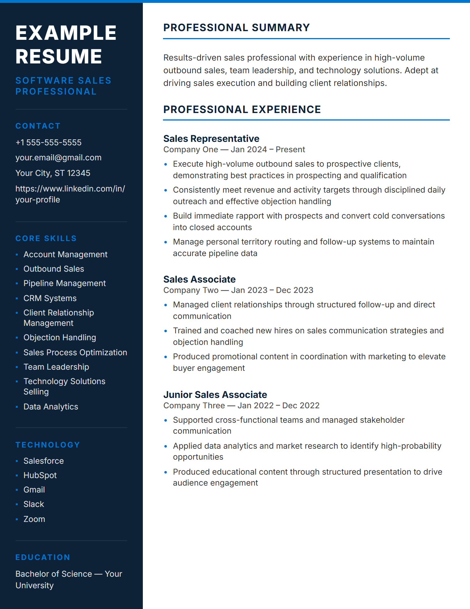
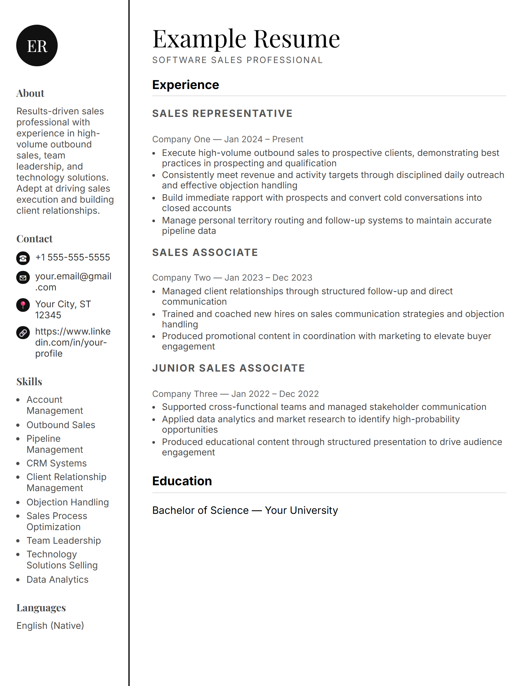
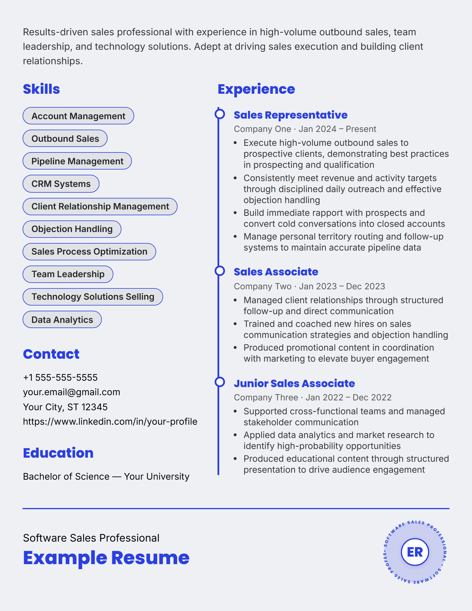
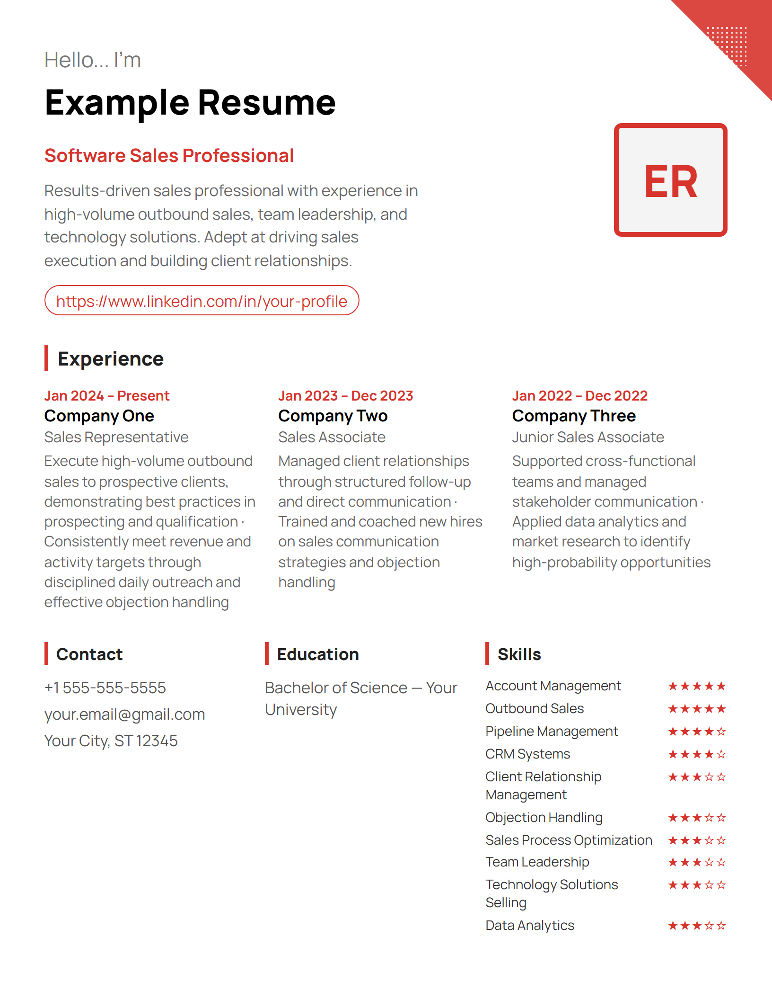
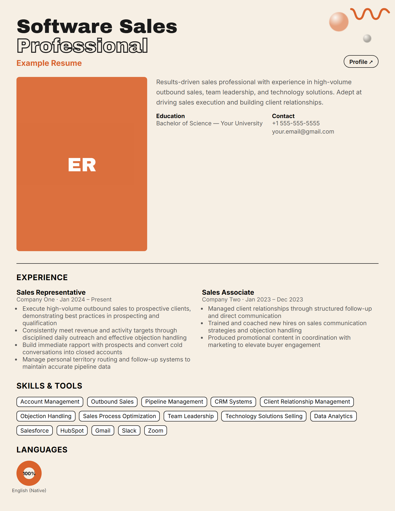
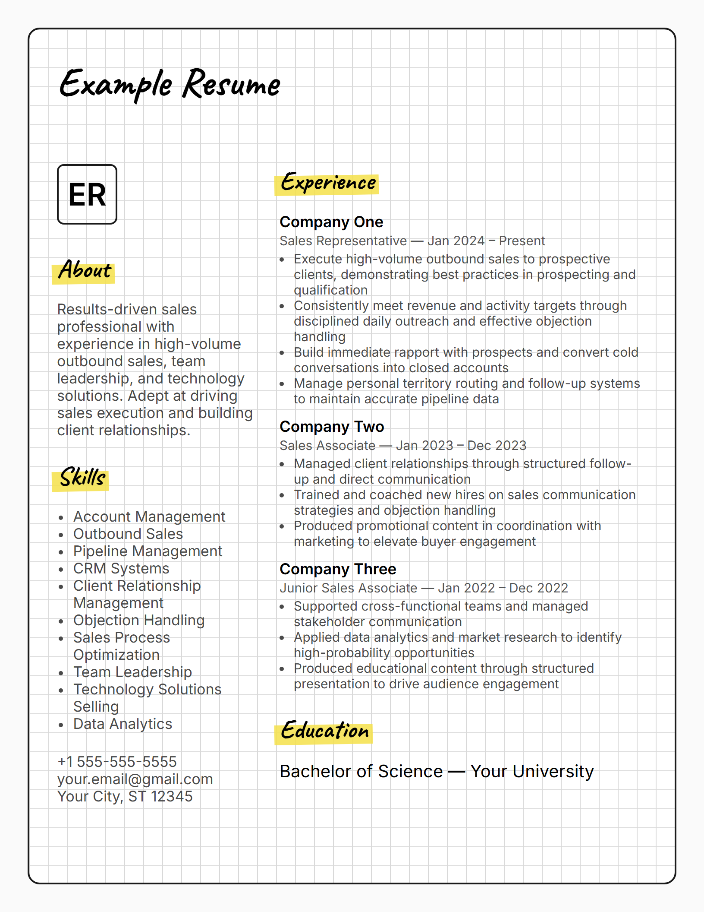
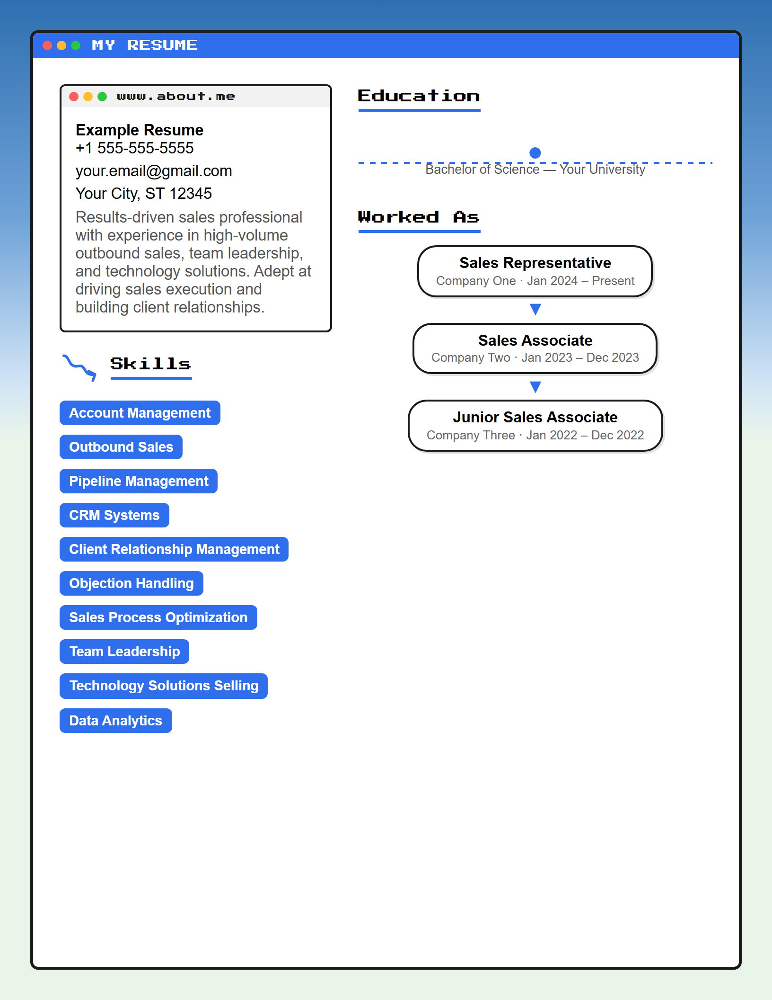
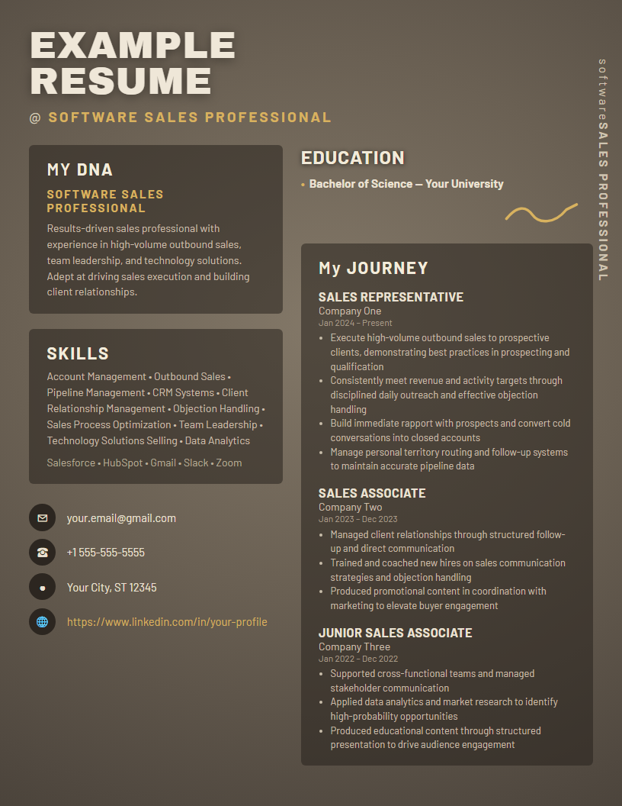
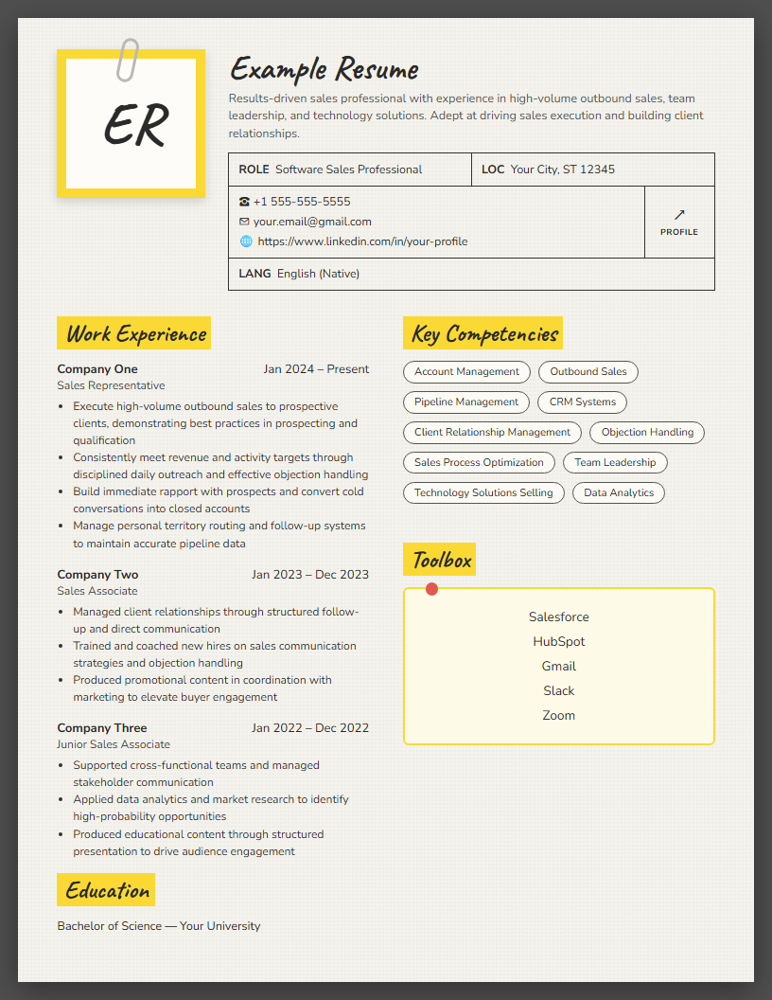

<div align="center">

# 🎯 Resume Tailor

### AI job-tailored resumes, run 100% locally. No cloud, no API keys, no subscription.

[](../LICENSE)
[](#-ai-tailoring--the-main-event)
[](package.json)
[](skills/claude-code/resume-tailor/SKILL.md)
[](skills/hermes/resume-tailor/SKILL.md)

**Give it your resume and a job posting → get back a resume rewritten for
*that* job → exported as a single-page PDF → in 9 designs, any accent color.**

</div>

Point it at a job description and it rewrites your summary, bullets, and
skill order to match — using a **local Ollama model**, so your resume data
never leaves your machine and you never pay a cloud AI subscription to
apply to a job. The design layer (9 genuinely distinct templates, one
`--accent` variable, an auto-fit engine that guarantees exactly one printed
page) exists to give that tailored content somewhere good to land.

Works three ways — **standalone CLI**, **native [Claude Code](https://claude.com/claude-code) skill**,
or **native Hermes Agent skill** — all three sharing the exact same
rendering/AI/PDF engine in `core/`. No reimplementations, no drift.

---

## 🖼️ See it in action

<table>
<tr>
<td width="33%"><p align="center"><code>dark-sidebar-accent</code></p></td>
<td width="33%"><p align="center"><code>editorial-serif-sidebar</code></p></td>
<td width="33%"><p align="center"><code>bold-two-column-timeline</code></p></td>
</tr>
<tr>
<td width="33%"><p align="center"><code>modern-accent-photo-header</code></p></td>
<td width="33%"><p align="center"><code>bold-poster-statement</code></p></td>
<td width="33%"><p align="center"><code>handwritten-highlight-creative</code></p></td>
</tr>
</table>

<table>
<tr>
<td width="33%"><p align="center"><code>playful-retro-window</code></p></td>
<td width="33%"><p align="center"><code>warm-spotlight-poster</code></p></td>
<td width="33%"><p align="center"><code>paper-id-card</code></p></td>
</tr>
</table>

Every one of these is the *same* example resume, same content — only
`--template` and `--accent` changed. That's the whole point: your tailored
content, any look you want, always exactly one page.

---

## 🤖 AI Tailoring — the main event

Point it at a job description (paste, file, or URL) and it rewrites your
resume's **summary, per-job bullets, and skill ordering** to speak directly
to that posting — swapping in the job's own terminology, reordering skills
so the relevant ones lead, without ever inventing a role or a metric that
isn't already true:

```bash
node bin/tailor.js --resume my-resume.json \
  --jd job-posting.txt --company "Acme Corp" --title "Account Executive"
```

What makes the tailoring trustworthy rather than just "AI slop rewrite":

- **Runs entirely on your machine.** Ollama (`gemma3`, `qwen2.5`, whatever
  you've pulled) does the rewriting — no API key, no cloud request, no
  resume data ever transmitted anywhere.
- **Never touches your actual work history.** Job titles, companies, and
  dates always come straight from your master resume; the model only ever
  rewrites summary/bullets/skills. It's a repositioning pass, not a
  ghostwriter inventing your career.
- **Zero fabricated numbers, by rule.** The prompt explicitly forbids
  adding percentages, dollar amounts, or metrics anywhere except dates —
  enforced in the instructions the model is given, not left to hope.
- **Small-model-safe.** Local 1–2B models frequently emit malformed JSON
  (raw newlines in strings, truncated brackets); `core/ai.js` repairs the
  most common failures before falling back to an untailored render rather
  than crashing.
- **Company voice-aware.** Pass `--company-info`/`--company-info-file`
  (mission statement, About page, brand tone notes) and the rewrite
  calibrates its formality/vocabulary to match — a casual startup posting
  reads differently than a formal enterprise one, even for the same
  underlying skills. Without it, tone is still inferred from the JD's own
  wording. Either way, it's word-choice only — never invented claims about
  the candidate's relationship to the company.
- **Design is secondary, but still one flag.** Add `--template`/`--accent`
  to the same command to also pick the visual design — see the gallery
  below. Skip the whole AI step with `--no-ai` if you just want to re-theme
  an existing resume untouched.

---

## 💡 Why this exists

Most "resume builder" tools either require a cloud AI subscription to
tailor content, lock you into one design, or produce HTML that looks fine
on screen and then reflows into two pages the moment you print it. This
repo fixes all three:

- **AI tailoring is local and optional** — never a forced cloud
  dependency. Point it at Ollama to rewrite content per job, or skip it
  entirely (`--no-ai`) and just render your resume as-is.
- **No fabricated content, ever.** The AI prompt explicitly forbids adding
  numbers, metrics, percentages, or dollar amounts anywhere except dates —
  it can rewrite and reorder what's true, never invent achievements.
- **9 genuinely different designs**, not one template with a color swap —
  dark sidebar, editorial serif, bold timeline, poster-style headline,
  handwritten/creative, retro OS-window chrome, a clean modern header, a
  warm spotlight poster, and a paper-on-desk ID-card look.
- **One `--accent` variable drives all theming** per template — changing
  the color is always a one-flag edit, never a multi-file hunt.
- **True single-page output.** A binary-search auto-fit step measures the
  real rendered height in a headless browser and finds the largest font
  size that fills exactly one US Letter page — no dead space, no overflow
  onto a second page, and the saved `.html` matches the exported `.pdf`
  exactly.

---

## 🎨 Template Gallery

| Template | Look | Default Accent |
|---|---|---|
| `dark-sidebar-accent` *(default)* | Dark navy sidebar, accent-colored labels/rules | `#0076CE` |
| `editorial-serif-sidebar` | Monochrome, serif name, framed initials badge | `#111111` |
| `bold-two-column-timeline` | Pill-tag skills, circle-marker experience timeline | `#2b3fe0` |
| `modern-accent-photo-header` | "Hello, I'm..." header, 3-column experience row | `#d6342c` |
| `bold-poster-statement` | Oversized outline-type headline, cream background | `#d9622b` |
| `handwritten-highlight-creative` | Graph-paper background, highlighter-marker headings | `#f5e14a` |
| `playful-retro-window` | OS-window chrome, dotted education timeline | `#2f6fed` |
| `warm-spotlight-poster` | Warm radial spotlight, oversized poster headline, translucent cards | `#d8b25f` |
| `paper-id-card` | Paper sheet on a dark desk, clipped ID-card header, handwritten highlights | `#fbd934` |

All 9 use initials (a monogram tile) instead of a photo — this engine is
built to run unattended, so there's no assumption of a human standing by to
supply a headshot mid-run.

Run `node bin/tailor.js --list-templates` any time to see this list plus
each template's current default accent.

### Not one of these 9? Bring your own.

`--custom-template <file.js>` swaps in any design instead of picking from
the gallery — point it at a JS file exporting `{ render(model), defaultAccent }`
and the CLI renders through that instead, with the exact same AI tailoring,
auto-fit, and PDF export behind it. See
[`examples/custom-template.example.js`](examples/custom-template.example.js)
for the full contract (a `.resume` element at `816×1056px`, `font-size:
var(--base, 10px)`, em-based nested sizing, root rule opening with the
literal `.resume {`).

```bash
node bin/tailor.js --custom-template my-design.js --accent "#7c3aed"
```

Two ways to get that file:
- **Write it yourself** — copy the example and edit the HTML/CSS directly.
- **Describe it or hand over a reference and let an agent write it** — this
  is exactly what the Claude Code and Hermes skills below are for: tell
  either agent what you want ("make it look like this screenshot," "I want
  a minimalist Swiss-grid design, black and white") and it authors a
  contract-following template file for you, then runs the CLI against it.
  See each skill's SKILL.md for the exact flow.

### Don't want to install anything at all?

Every template also ships as a plain, standalone `.html` file with
`{{token}}` placeholders in [`templates/`](templates/) — no Node, no CLI,
no build step. Copy one, find-and-replace the tokens with your info in any
text editor, duplicate the job block for more roles, open it in a browser,
and Print → Save as PDF. It's the exact same design as its CLI counterpart,
just with the data-filling done by hand instead of by the pipeline. See
[`templates/dark-sidebar-accent.html`](templates/dark-sidebar-accent.html)
for the pattern — every file has a comment block at the top explaining it.

---

## 🚀 Quick Start (CLI, no agent)

```bash
git clone https://github.com/DimeDataCloud/tailorcv.git
cd tailorcv/engine

# PDF export needs Playwright's bundled Chromium (one-time, optional —
# without it you still get the .html file, just not the .pdf):
npm install playwright
npx playwright install chromium

# Tailor your own resume to a specific job posting (needs Ollama running):
node bin/tailor.js --resume my-resume.json \
  --jd job-posting.txt --company "Acme Corp" --title "Account Executive" \
  --template dark-sidebar-accent --accent "#0076CE"

# Also match the company's own brand voice (mission statement, About page, tone):
node bin/tailor.js --resume my-resume.json \
  --jd job-posting.txt --company "Acme Corp" --title "Account Executive" \
  --company-info-file acme-about-page.txt

# Just want a themed render with no AI/job-specific tailoring? Skip it:
node bin/tailor.js --template editorial-serif-sidebar --accent "#0f766e" --no-ai
```

Output lands in `output/<date>-<company-or-name>/`: `resume.json` (the
merged data), `resume.html`, and `resume.pdf` (if Playwright's browser is
installed).

### Resume data schema

See [`examples/example-resume.json`](examples/example-resume.json) for a
full working example. Shape:

```
name, title, email, phone, linkedin, location,
skills: [string],
tools: [string],
education: string,
languages: [string],
summary: string,
workHistory: [{ title, company, location, dates, bullets: "newline-separated string" }],
extraSections: [{ title, items: [string] }]
```

### CLI reference

```
node bin/tailor.js --resume <path.json> [options]

Job tailoring (all optional — omit to just render the resume as-is):
  --jd <file>            Read the job description from a text file
  --url <url>            Fetch the job description from a URL
  --text "<jd text>"     Pass the job description inline
  --company "<name>"     Target company (default: "Unknown Company")
  --title "<role>"       Target role (default: "Unknown Role")
  --company-info "<text>"      Company background/brand voice, calibrates tone only
  --company-info-file <file>   Same, read from a file
  --no-ai                Skip the Ollama tailoring step even if a JD is given
  --model <name>         Ollama model to use (default: gemma3)
  --ollama-url <url>     Ollama base URL (default: http://localhost:11434)

Design:
  --template <name>      See the gallery above (default: dark-sidebar-accent)
  --accent "#hex"        Theme color (default: the template's own default accent)

  --custom-template <file.js>  Use your own design (overrides --template) — see
                          examples/custom-template.example.js for the contract

Output:
  --out <dir>            Output directory (default: ./output/<date>-<slug>/)
  --no-pdf               Skip PDF export (HTML + JSON only — no Playwright required)

  --list-templates       Print the template gallery and exit
```

---

## 🧩 Native Agent Setups

### Claude Code

Copy the skill folder into your Claude Code skills directory:

```bash
cp -r skills/claude-code/resume-tailor ~/.claude/skills/resume-tailor
```

Then just talk to it: *"tailor my resume for this job posting"* or
*"change my resume to the editorial serif template in teal"*. The skill
(`skills/claude-code/resume-tailor/SKILL.md`) gathers your resume data and
preferences conversationally, then shells out to `bin/tailor.js` via the
Bash tool and reports back the output paths — it never reimplements the
rendering logic itself.

### Hermes Agent

Copy the skill folder into your Hermes skills directory (adjust the
category folder to match your install — this repo uses `productivity` as
an example):

```bash
cp -r skills/hermes/resume-tailor ~/AppData/Local/hermes/skills/productivity/resume-tailor
```

The skill (`skills/hermes/resume-tailor/SKILL.md`) follows Hermes' skill
frontmatter conventions (`metadata.hermes.tags`, `related_skills`) and
documents the same CLI, common pitfalls, and a verification checklist.

Both skill files are documentation + orchestration only — all executable
logic lives in `core/` and `bin/`, so fixing a bug or adding a template
updates both agent experiences at once.

---

## 🏗️ Architecture

```
engine/
├── core/
│   ├── render.js     9 template renderers + buildModel() + TEMPLATES registry
│   ├── ai.js          optional Ollama call + small-model JSON repair
│   ├── select.js      trims a large job-history pool to the ~4 most relevant roles
│   └── pdf.js         Playwright auto-fit + single-page PDF export
├── bin/
│   └── tailor.js      CLI orchestrator — the only thing either skill shells out to
├── examples/
│   └── example-resume.json
└── skills/
    ├── claude-code/resume-tailor/SKILL.md
    └── hermes/resume-tailor/SKILL.md
```

### The auto-fit contract

Every template's `.resume` element is fixed at `816×1056px` (US Letter @
96dpi) with `font-size: var(--base, 10px)` and all nested sizing in `em`.
`core/pdf.js` binary-searches `--base` (9 iterations) until the rendered
content's `scrollHeight` fits under a 1038px target, then bakes the fitted
value into the saved `.html` by replacing the literal `.resume {` rule —
so the file you open in a browser and the PDF you get are pixel-identical.
Adding a 10th template means keeping this exact contract (see the Hermes
skill's "Common Pitfalls" section for the one gotcha: the root CSS rule
must open with exactly `.resume {`).

### AI tailoring (optional, local-only)

`core/ai.js` sends only the summary/bullets/skills/title to the LLM —
never the work-history structure (titles/companies/dates always come from
your master resume) — which keeps prompts small enough that even 1–2B
local models don't truncate mid-JSON. A repair pass in `parseJSON()`
recovers the most common local-model JSON failures (raw newlines inside
string literals, unclosed brackets, trailing commas) before giving up and
falling back to untailored rendering.

An optional `companyInfo` block (from `--company-info`/`--company-info-file`)
gets folded into the same prompt purely as tone/vocabulary calibration —
the rules explicitly forbid copying it verbatim or inventing any claim
about the candidate's relationship to the company. Without it, the model
still infers register from the job description's own wording.

---

## ❓ FAQ / Common Pitfalls

- **PDF didn't export?** `npm install playwright` alone doesn't download a
  browser. Run `npx playwright install chromium` once. The CLI detects
  this and tells you the exact command instead of failing silently.
- **AI tailoring did nothing?** Ollama isn't running, or the target model
  isn't pulled. Start it with `ollama serve` and `ollama pull gemma3` (or
  point `--model`/`--ollama-url` at whatever you have).
- **`--url` returned junk?** Heavily JS-rendered job boards won't work with
  the built-in plain-HTTP fetch (no headless browser, by design, to keep
  the CLI dependency-light). Copy-paste the description instead, via
  `--jd <file>` or `--text "..."`.
- **Want a 10th template?** Add a `render...()` function + registry entry
  in `core/render.js`, following the auto-fit contract described above.
  Both skills automatically gain it — no separate wiring needed.

---

## ⭐ Support this project

If this saved you from hand-editing resume CSS at 1am before an application
deadline, a star helps other job-seekers find it too — that's the whole
distribution model for a repo like this.

Found a bug, want a 10th template, or built an integration for another
agent platform? Issues and PRs are welcome — see the Architecture section
above for how the pieces fit together before diving in.

---

## License

MIT — see [LICENSE](../LICENSE).
